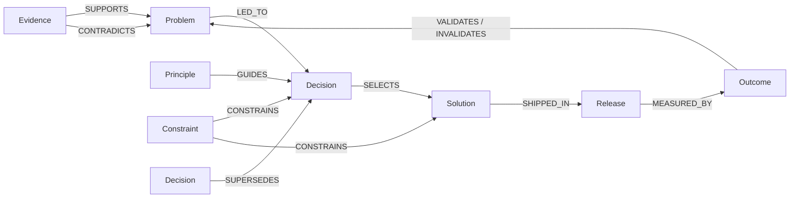
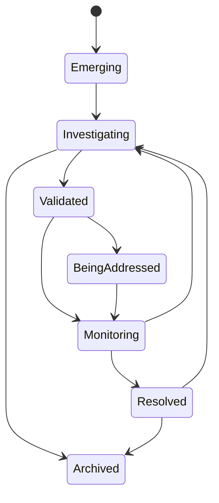
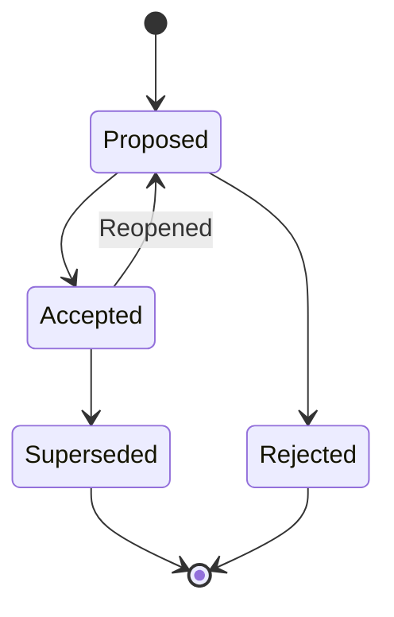
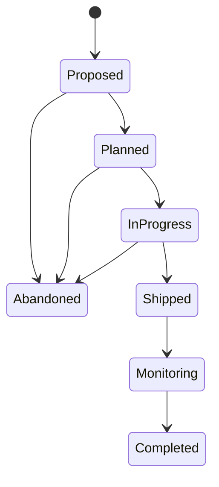
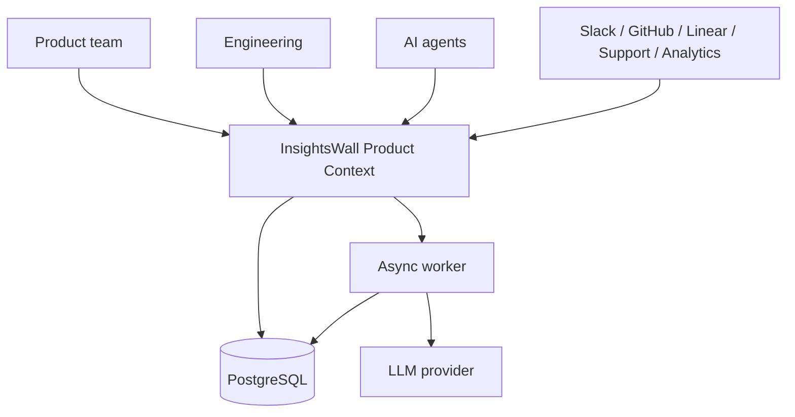
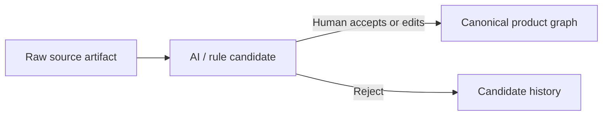
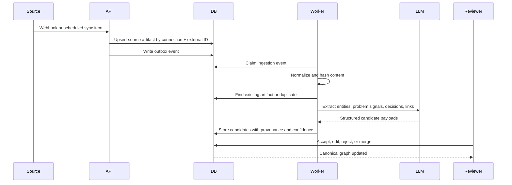

# Domain Model and Architecture

## 1. Architectural stance

The recommended implementation is a **modular monolith** inside the existing InsightsWall repository.

Retain:

- authentication;
- organizations/workspaces;
- products/projects;
- memberships and roles;
- comments;
- notifications;
- attachments;
- deployment and observability;
- frontend and API foundations.

Introduce a new product-context domain rather than renaming feedback tables into increasingly generic shapes.

## 2. Ubiquitous language

| Term | Meaning |
|---|---|
| Workspace | Billing, identity, and membership boundary |
| Product | A software product or product area with its own context graph |
| Product object | A canonical node in the product graph |
| Evidence | Source-backed observation or artifact |
| Problem | Durable statement of user or business pain |
| Decision | Structured record of a meaningful choice |
| Solution | Proposed or implemented response to a problem |
| Release | Delivery of a solution to users |
| Outcome | Observed result after delivery |
| Principle | Durable product guideline |
| Constraint | Limitation affecting a decision or solution |
| Link | Typed relationship between two product objects |
| Source connection | Configured integration |
| Source artifact | Raw imported item from a source |
| Candidate | AI- or rule-generated proposal awaiting review |
| Canonical knowledge | Human-accepted product object or relationship |
| Provenance | Where a statement or link came from |
| Supersession | Replacement of a prior decision without erasing history |

## 3. Core aggregate model



The graph is explicit in storage through typed links. A visual graph editor is not required.

## 4. Object lifecycles

### 4.1 Problem



### 4.2 Decision



### 4.3 Solution



## 5. System context



## 6. Module boundaries

```text
src/
  modules/
    identity/
    workspaces/
    products/
    product-graph/
    evidence/
    decisions/
    solutions/
    outcomes/
    sources/
    intelligence/
    review/
    search/
    notifications/
    audit/
    agent-context/
```

### 6.1 Product Graph

Owns:

- product object identity;
- object kinds;
- typed links;
- graph traversal;
- merge and archive behavior;
- shared object history.

It should not own source ingestion or LLM calls.

### 6.2 Evidence and Sources

Owns:

- source connections;
- sync cursors;
- webhooks;
- raw artifacts;
- content normalization;
- import idempotency;
- provenance.

### 6.3 Intelligence

Owns:

- extraction;
- summarization;
- clustering;
- duplicate detection;
- relationship suggestions;
- contradiction suggestions;
- candidate confidence and model metadata.

It must not write directly into canonical graph tables.

### 6.4 Review

Owns:

- candidate inbox;
- assignment;
- accept/edit/reject/merge workflows;
- reviewer activity;
- feedback about candidate quality.

### 6.5 Decisions

Owns:

- decision-specific invariants;
- alternatives;
- rationale;
- supersession;
- review dates;
- conflict checks.

### 6.6 Search and Agent Context

Owns:

- keyword and semantic retrieval;
- graph expansion;
- context bundles;
- source-backed explanations;
- bounded outputs for external agents.

## 7. Three-layer knowledge model

The critical separation:



### Layer 1: Source artifact

An immutable imported or pasted item.

Examples:

- Slack message or thread;
- GitHub issue;
- current InsightsWall suggestion;
- transcript excerpt;
- analytics observation.

### Layer 2: Candidate

A proposal such as:

- “These 14 items describe the same problem.”
- “This thread contains a decision.”
- “This evidence contradicts the accepted assumption.”
- “This pull request implements Solution X.”

### Layer 3: Canonical graph

Accepted product knowledge. Canonical objects may be edited and versioned, but their source history remains visible.

## 8. Ingestion pipeline



## 9. Application flow for accepted candidates

Accepting a candidate is an application command, not a direct table insert.

```text
AcceptCandidate
  1. Verify permission and candidate status.
  2. Validate candidate payload by type.
  3. Create or update canonical objects.
  4. Create typed links with origin = AI_ACCEPTED.
  5. Record reviewer and source provenance.
  6. Mark candidate accepted.
  7. Append audit events.
  8. Write outbox events for indexing and notifications.
```

The operation should be transactional.

## 10. Relational graph approach

Use PostgreSQL rather than a graph database.

Advantages:

- aligns with the existing stack;
- transactional consistency;
- simple authorization joins;
- mature migrations and tooling;
- normal SQL for product views;
- recursive CTEs are sufficient for bounded graph traversal;
- fewer operational dependencies.

Example traversal:

```sql
WITH RECURSIVE context AS (
  SELECT
    po.id,
    po.kind,
    0 AS depth
  FROM product_objects po
  WHERE po.id = $1

  UNION ALL

  SELECT
    linked.id,
    linked.kind,
    context.depth + 1
  FROM context
  JOIN object_links ol
    ON ol.from_object_id = context.id
    OR ol.to_object_id = context.id
  JOIN product_objects linked
    ON linked.id = CASE
      WHEN ol.from_object_id = context.id THEN ol.to_object_id
      ELSE ol.from_object_id
    END
  WHERE context.depth < $max_depth
)
SELECT DISTINCT * FROM context;
```

Guard traversals with:

- maximum depth;
- allowed relationship types;
- product boundary;
- result limit;
- cycle protection.

## 11. Search architecture

Search should combine three methods.

### 11.1 Structured filters

- object kind;
- lifecycle status;
- owner;
- source;
- date;
- product;
- relationship type.

### 11.2 Full-text search

Use PostgreSQL full-text search initially for titles, summaries, decision rationale, and normalized evidence content.

### 11.3 Semantic retrieval

Add embeddings later for:

- duplicate candidates;
- related evidence;
- problem discovery;
- question answering.

Embeddings locate likely nodes. Graph links establish trusted context.

## 12. Context bundle generation

A context request should be explicit and bounded.

```typescript
type ProductContextRequest = {
  productId: string;
  subject:
    | { type: "object"; objectId: string }
    | { type: "query"; query: string }
    | { type: "external_reference"; source: string; externalId: string };
  include?: Array<
    "problems" |
    "evidence" |
    "decisions" |
    "solutions" |
    "constraints" |
    "principles" |
    "outcomes"
  >;
  maxDepth?: number;
  maxItems?: number;
};
```

The response should include:

- concise summary;
- canonical objects;
- typed relationships;
- source citations;
- uncertainty;
- stale or conflicting context;
- machine-readable IDs.

## 13. Authorization

All canonical nodes, links, candidates, and source artifacts belong to one product, which belongs to one workspace.

Authorization checks should be performed at application service boundaries.

Suggested roles:

| Role | Read | Create/edit | Review candidates | Manage integrations | Manage members |
|---|---:|---:|---:|---:|---:|
| Owner | Yes | Yes | Yes | Yes | Yes |
| Admin | Yes | Yes | Yes | Yes | Optional |
| Editor | Yes | Yes | Yes | Yes, if granted | No |
| Viewer | Yes | No | No | No | No |

Do not rely solely on frontend controls.

## 14. Audit and version history

Track:

- object created;
- object edited;
- status changed;
- object linked/unlinked;
- candidate accepted/rejected;
- decision superseded;
- problem merged;
- source artifact imported;
- outcome recorded.

For decision records, store field-level or snapshot versions so historical rationale can be inspected.

## 15. Outbox and worker model

Use a transactional outbox table.

Typical events:

```text
source_artifact.ingested
candidate.created
candidate.accepted
product_object.created
product_object.updated
object_link.created
decision.superseded
solution.shipped
outcome.recorded
search.reindex_requested
notification.requested
```

A worker claims events with `FOR UPDATE SKIP LOCKED`.

A dedicated queue product can be introduced only when operational needs justify it.

## 16. Observability

Minimum telemetry:

- ingestion lag;
- import failures by source;
- candidate generation latency;
- LLM cost by candidate type;
- candidate acceptance rate;
- duplicate artifact rate;
- outbox age;
- indexing lag;
- context request latency;
- permission-denied attempts.

Log correlation IDs through API, outbox, worker, and LLM calls.

## 17. Security and privacy

- Encrypt integration credentials.
- Store the minimum source content required.
- Provide workspace-level data deletion.
- Preserve external source URLs where permitted.
- Make source-retention policies configurable later.
- Redact secrets and obvious credentials before LLM processing.
- Keep model provider and prompt version in candidate metadata.
- Do not train shared models on customer content without explicit agreement.
- Ensure deleted integrations stop future sync immediately.
- Separate source deletion from canonical knowledge deletion and make the consequence explicit.

## 18. Architectural decisions

### ADR-001: Reuse the existing repository

**Decision:** build Product Context as v2 modules within InsightsWall.

**Reason:** the platform infrastructure is valuable; the old domain assumptions are not.

### ADR-002: New canonical domain tables

**Decision:** create new graph-oriented tables rather than rename `suggestions` into `problems`.

**Reason:** feedback and problems are semantically different, and migration requires clustering.

### ADR-003: PostgreSQL relational graph

**Decision:** model nodes and typed edges in PostgreSQL.

**Reason:** simpler operations and sufficient graph capabilities.

### ADR-004: Candidates cannot mutate canonical truth directly

**Decision:** AI output is stored as reviewable candidates.

**Reason:** trust, auditability, and reversibility.

### ADR-005: Modular monolith

**Decision:** keep modules in one deployable application plus a worker.

**Reason:** current scale does not justify distributed services.

### ADR-006: Application services are interface-independent

**Decision:** UI, REST, imports, CLI, and future MCP call the same commands and queries.

**Reason:** avoid duplicated business logic and make agent support additive.

## 19. Deferred architecture

Do not add during MVP:

- Neo4j;
- Kafka;
- event sourcing;
- separate vector database;
- multi-region writes;
- fully autonomous agents;
- custom graph query language;
- per-object access control;
- general workflow automation builder;
- bidirectional synchronization across integrations.
