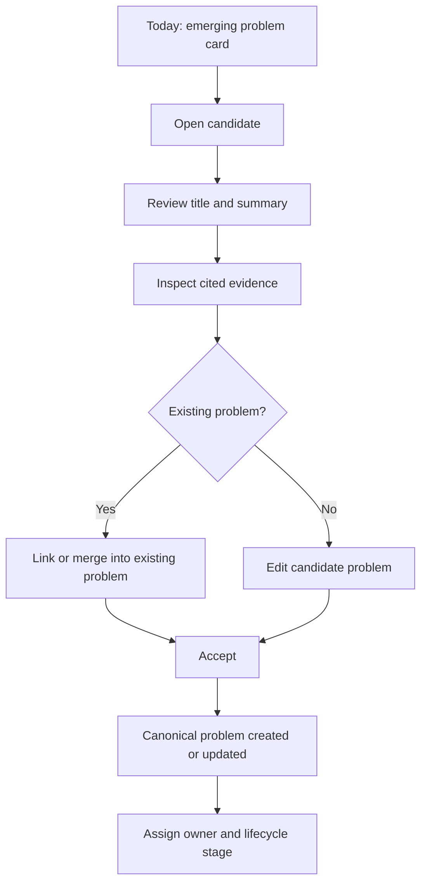
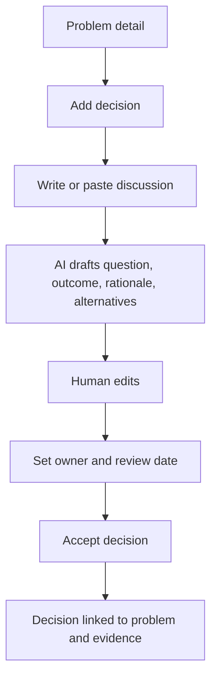
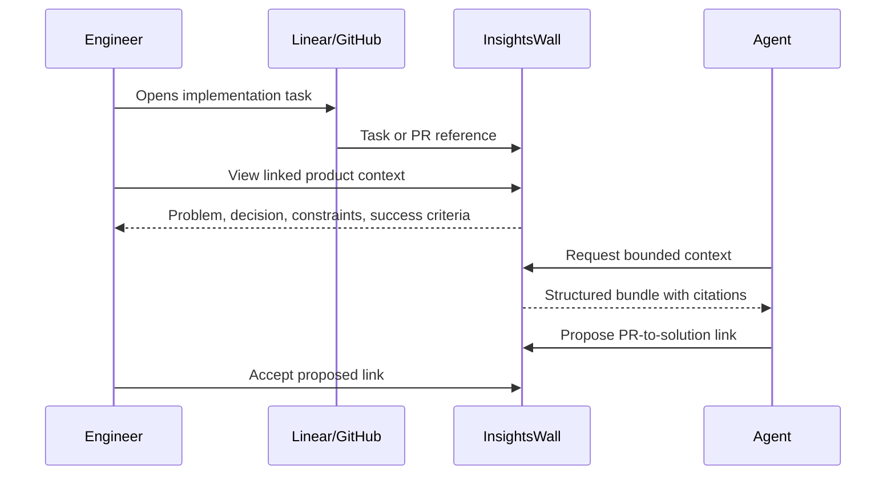
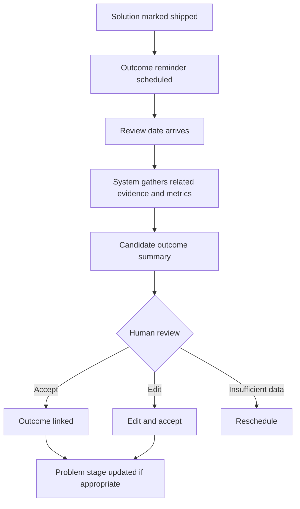
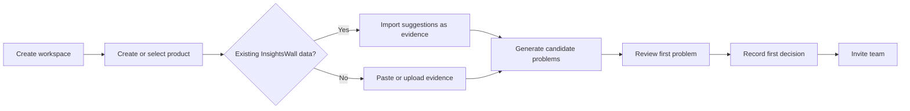

# UX, Journeys, and UI Direction

## 1. UX thesis

The interface should feel like a calm, evidence-backed operating system for product work.

It should not feel like:

- a public feedback portal;
- a project-management board;
- an AI chat wrapper;
- a graph database viewer;
- a document editor with extra metadata.

The product should reward a daily habit:

> Review what changed, confirm what matters, and preserve why.

## 2. Primary information architecture

```text
Workspace
└── Product
    ├── Today
    ├── Problems
    ├── Decisions
    ├── Solutions
    ├── Evidence
    ├── Review
    ├── Search / Ask
    ├── Integrations
    └── Settings
```

Potential later sections:

```text
Releases
Outcomes
Principles
Constraints
Customers
```

For MVP, Releases, Principles, and Constraints can appear as linked object types without dedicated sidebar sections.

## 3. Navigation concept

```text
┌──────────────────────────────┐
│ InsightsWall                 │
│ Product: Analytics Platform  │
├──────────────────────────────┤
│ Today                    12  │
│ Problems                      │
│ Decisions                 3  │
│ Solutions                     │
│ Evidence                      │
│ Review                    8  │
│ Search / Ask                  │
├──────────────────────────────┤
│ Integrations                  │
│ Product settings              │
└──────────────────────────────┘
```

Counts should represent actionable work, not vanity totals.

## 4. Design principles

### 4.1 Provenance is always visible

AI-generated or imported content should show:

- source icon;
- source title;
- source timestamp;
- author when available;
- whether it is accepted, proposed, or inferred.

### 4.2 Candidate and canonical states look different

Candidate content should never be visually indistinguishable from accepted knowledge.

Suggested distinction:

- candidate: bordered suggestion card, confidence, review actions;
- canonical: normal object presentation, history, owner, status;
- imported evidence: source-branded metadata and original-content access.

### 4.3 Dense but calm

Product teams need information density, but the interface should prioritize:

1. the object’s current meaning;
2. the evidence and rationale;
3. the lifecycle;
4. related context;
5. history.

### 4.4 AI is embedded into workflows

Avoid making chat the main navigation. Use AI for:

- suggested links;
- drafted summaries;
- candidate problems;
- decision extraction;
- contradiction warnings;
- context answers with citations.

### 4.5 Graph relationships are expressed as context sections

A full node-link visualization is deferred. Use clear relationship groups:

```text
Supported by
Led to
Constrained by
Addressed by
Shipped in
Measured by
```

## 5. Core journey: reviewing an emerging problem



### Candidate review screen

```text
┌─────────────────────────────────────────────────────────────────────┐
│ Candidate problem                                      Confidence 87%│
├─────────────────────────────────────────────────────────────────────┤
│ Customers cannot organize large dashboard collections              │
│                                                                     │
│ Teams with more than 50 dashboards struggle to find and group them. │
│                                                                     │
│ Suggested stage: Emerging                                           │
├──────────────────────────────┬──────────────────────────────────────┤
│ Supporting evidence (14)     │ Similar existing problems            │
│                              │                                      │
│ Zendesk · Ticket #821        │ Dashboard discoverability · 72%      │
│ “We have 180 dashboards…”    │ Workspace navigation · 41%           │
│                              │                                      │
│ Feedback · Request #112      │                                      │
│ “Folders would help…”        │                                      │
├──────────────────────────────┴──────────────────────────────────────┤
│ [Reject] [Merge into existing] [Edit and accept] [Accept]           │
└─────────────────────────────────────────────────────────────────────┘
```

## 6. Core journey: recording a decision



### Decision composer

```text
┌───────────────────────────────────────────────────────────────────┐
│ New decision                                                       │
├───────────────────────────────────────────────────────────────────┤
│ Question                                                           │
│ Should dashboard collections support nesting?                      │
│                                                                    │
│ Outcome                                                            │
│ No. Support one level only.                                        │
│                                                                    │
│ Rationale                                                          │
│ [Rich text drafted from selected evidence/discussion]              │
│                                                                    │
│ Alternatives                                                       │
│ 1. Unlimited nesting — rejected due to navigation complexity       │
│ 2. Labels only — insufficient for the primary use case             │
│                                                                    │
│ Consequences                                                       │
│ Existing permissions continue at dashboard level.                  │
│                                                                    │
│ Owner [Xavi]             Review on [Jan 2027]                       │
├───────────────────────────────────────────────────────────────────┤
│ Linked problem: Dashboard organization                             │
│ Sources: Slack thread · 3 interviews · architecture note           │
├───────────────────────────────────────────────────────────────────┤
│ [Save as proposal] [Accept decision]                               │
└───────────────────────────────────────────────────────────────────┘
```

## 7. Core journey: understanding a problem

The problem detail page is the centrepiece.

```text
┌────────────────────────────────────────────────────────────────────────────┐
│ Dashboard organization                                      VALIDATED       │
│ Enterprise teams cannot efficiently organize large dashboard collections. │
│ Owner: Maya · Updated 2h ago · 47 evidence items                          │
├────────────────────────────────────────────────────────────────────────────┤
│ Impact                                                                     │
│ 18 enterprise accounts · $82k linked ARR · Support mentions +31%          │
├───────────────────────────────┬────────────────────────────────────────────┤
│ Context                       │ Activity / Discussion                      │
│                               │                                            │
│ Evidence                      │ Maya accepted 4 evidence links             │
│ • 24 feedback items           │ Sam proposed a decision                    │
│ • 13 support tickets          │ Release 3.8 linked                         │
│ • 6 interviews                │                                            │
│ • 4 analytics observations    │                                            │
│                               │                                            │
│ Decisions                     │                                            │
│ ✓ One-level collections       │                                            │
│ ○ Revisit nested folders Q1   │                                            │
│                               │                                            │
│ Solutions                     │                                            │
│ Collections · Shipped         │                                            │
│ Saved views · Proposed        │                                            │
│                               │                                            │
│ Outcomes                      │                                            │
│ Support requests ↓31%         │                                            │
├───────────────────────────────┴────────────────────────────────────────────┤
│ [Add evidence] [Record decision] [Add solution] [Record outcome]           │
└────────────────────────────────────────────────────────────────────────────┘
```

### Page hierarchy

1. Problem statement
2. Status, owner, impact
3. Current summary
4. Evidence
5. Decisions
6. Solutions and releases
7. Outcomes
8. Constraints and principles
9. Activity and discussion

## 8. Core journey: engineering context



## 9. Core journey: post-release outcome



## 10. Today / intelligence inbox

The Today page should answer:

- What changed?
- What needs review?
- Which problems are emerging?
- Which decisions are stale or contradicted?
- Which shipped solutions lack outcomes?

```text
┌────────────────────────────────────────────────────────────────────┐
│ Today                                                               │
│ Tuesday, 21 July                                                    │
├────────────────────────────────────────────────────────────────────┤
│ Emerging                                                            │
│ 🔴 Dashboard export failures · mentions +43% · 12 new sources       │
│ [Review]                                                            │
├────────────────────────────────────────────────────────────────────┤
│ Decisions                                                           │
│ 🟡 Candidate: Do not support nested folders                         │
│ Extracted from Slack · confidence 92%                               │
│ [Review]                                                            │
├────────────────────────────────────────────────────────────────────┤
│ Outcomes                                                            │
│ 🔵 Collections may be improving dashboard organization             │
│ Support volume ↓31% after release 3.8                               │
│ [Record outcome]                                                    │
├────────────────────────────────────────────────────────────────────┤
│ Hygiene                                                             │
│ 3 shipped solutions have no outcome · 2 decisions due for review   │
└────────────────────────────────────────────────────────────────────┘
```

## 11. Problems list

Recommended default: table/list, not kanban.

Columns:

- problem;
- stage;
- trend;
- evidence count;
- source mix;
- affected segments;
- owner;
- last activity;
- active solution.

Saved views:

- Emerging
- Validated
- Being addressed
- Monitoring
- No owner
- No recent evidence
- Increasing rapidly

Kanban can be optional.

## 12. Decisions register

```text
┌─────────────────────────────────────────────────────────────────────┐
│ Decisions                                                           │
├─────────────────────────────────────────────────────────────────────┤
│ Search...       Status: Accepted       Review: Due / Upcoming        │
├─────────────────────────────────────────────────────────────────────┤
│ One-level collections only                Accepted · Review Jan 2027 │
│ Problem: Dashboard organization · 8 sources                          │
│                                                                       │
│ Store exports for 30 days                  Accepted · Review overdue  │
│ Constraint: Data retention · Supersedes D-18                          │
│                                                                       │
│ Do not support anonymous workspaces         Proposed                  │
└─────────────────────────────────────────────────────────────────────┘
```

Key affordances:

- accepted/rejected/proposed/superseded filter;
- due-for-review filter;
- conflict badge;
- source count;
- related product area;
- supersession chain.

## 13. Evidence view

Evidence should be optimized for triage.

Each item shows:

- source;
- original timestamp;
- author/account;
- excerpt;
- linked problems;
- candidate links;
- import state;
- duplicate state.

Bulk actions:

- link to problem;
- create candidate problem;
- merge duplicates;
- mark irrelevant;
- archive from active review.

## 14. Search / Ask

Search comes first. Ask is an enhanced mode.

Example:

```text
Why do collections only support one level?
```

Answer structure:

```text
Answer
The team chose one-level collections because the primary customer need was
basic grouping, while nested navigation would increase permission and UX
complexity.

Canonical context
• Decision: One-level collections only
• Problem: Dashboard organization
• Constraint: Dashboard-level permissions

Sources
• Slack thread, 12 Mar 2026
• Customer interview, Acme Corp
• Architecture note, Collections permissions

Uncertainty
The decision is due for review in January 2027.
```

Every answer links to the underlying objects.

## 15. Empty states

### Empty Today

> No new intelligence needs your attention. Explore active problems or import evidence.

### Empty Problems

> Problems connect evidence to decisions and outcomes. Create one manually or import feedback to discover candidate problems.

### Empty Review

> Nothing is waiting for review. New candidates appear as evidence is imported and analyzed.

## 16. Onboarding journey



Activation should happen before asking the user to configure multiple integrations.

## 17. Visual direction

### Tone

- professional;
- calm;
- analytical;
- trustworthy;
- product-native;
- not playful or overtly “AI”.

### Visual cues

- strong typography and spacing;
- neutral surfaces;
- restrained status accents;
- source icons;
- relationship chips;
- compact metadata;
- clear distinction between proposed and accepted content;
- subtle timeline and version history.

### Reference blend

The interaction character may borrow from:

- Linear: speed and density;
- GitHub: history, review, and source relationships;
- Notion: readable content;
- modern observability tools: evidence and drill-down.

It should not visually clone any of them.

## 18. Responsive strategy

Desktop is primary for authoring and review.

Mobile supports:

- reading context;
- approving or rejecting simple candidates;
- commenting;
- viewing Today;
- searching.

Complex linking and decision editing may remain desktop-first.

## 19. Accessibility

- All candidate actions keyboard accessible.
- Status is never communicated by color alone.
- Relationship labels are readable text.
- Source excerpts can be expanded without hover.
- Confidence is presented numerically and textually.
- Focus order follows review flow.
- AI-generated text is labelled for assistive technology.
