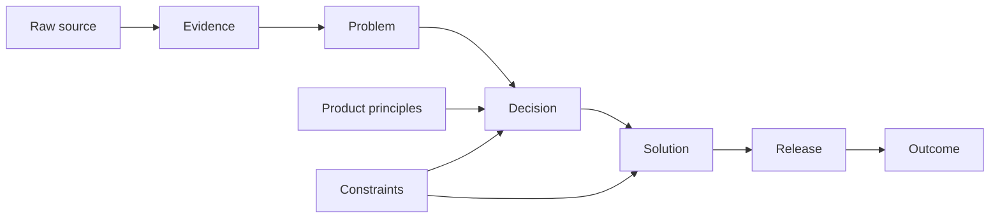

# InsightsWall Product Context — Product & Engineering Pack

**Working name:** InsightsWall Product Context  
**Product direction:** evolve InsightsWall from a feedback board into the canonical product-context layer connecting evidence, problems, decisions, solutions, releases, and outcomes.

This pack is designed to be:

- readable by product and engineering;
- suitable for committing into the existing repository;
- usable as context for Codex or another coding agent;
- explicit about what is MVP, what is later, and what remains unresolved.

## Document map

1. [`01-PRD.md`](./01-PRD.md)  
   Product vision, users, jobs-to-be-done, scope, requirements, metrics, risks, and product principles.

2. [`02-DOMAIN-AND-ARCHITECTURE.md`](./02-DOMAIN-AND-ARCHITECTURE.md)  
   Domain language, product graph, module boundaries, system architecture, ingestion pipeline, AI trust model, and architectural decisions.

3. [`03-DATABASE-AND-API.md`](./03-DATABASE-AND-API.md)  
   PostgreSQL model, Mermaid ER diagram, key tables and enums, application commands and queries, REST shape, events, and MCP direction.

4. [`04-UX-AND-UI.md`](./04-UX-AND-UI.md)  
   Information architecture, core journeys, review workflows, interaction principles, page specifications, and low-fidelity UI diagrams.

5. [`05-PHASED-IMPLEMENTATION.md`](./05-PHASED-IMPLEMENTATION.md)  
   Phased delivery plan, vertical slices, epics, acceptance criteria, dependencies, test strategy, and suggested implementation order.

6. [`06-MIGRATION-VALIDATION-AND-RISKS.md`](./06-MIGRATION-VALIDATION-AND-RISKS.md)  
   Migration from the current InsightsWall model, discovery plan, beta strategy, pricing hypotheses, risk register, and open decisions.

7. [`07-HANDOFF.md`](./07-HANDOFF.md)  
   A concise execution brief for a coding agent that has access to the repository.

8. [`product-context/repository-audit.md`](./product-context/repository-audit.md)  
   The repository-specific assessment, reuse plan, schema direction, migration sequence, risks, milestones, and first implementation PR plan.

9. [`product-context/README.md`](./product-context/README.md)  
   The lean coordinator-led path through core capability, usable experience, and a private MVP release.

10. [`product-context/lean-plan.md`](./product-context/lean-plan.md)  
    The current founder-stage scope, deliberate simplifications, accepted limitations, and triggers for revisiting deferred infrastructure.

## Core thesis

> Git remembers what changed. InsightsWall should remember why the product is the way it is.

The product should not try to replace Linear, Jira, Slack, GitHub, Notion, support tools, or analytics. It should own the reasoning layer that connects them.

## Core lifecycle



## Architectural direction

- Reuse the existing repository and platform foundation.
- Introduce a new v2 domain rather than stretching feedback-specific tables.
- Keep a modular monolith.
- Use PostgreSQL as a relational graph.
- Separate raw source artifacts, AI candidates, and accepted canonical knowledge.
- Make provenance and review first-class.
- Delay graph visualization, broad integrations, and MCP until the human workflow is useful.

## Repository layout

```text
/docs/product-context/
  README.md                    # execution index and operating rules
  repository-audit.md         # repository-specific implementation assessment
  lean-plan.md                # current scope; supersedes rollout-grade audit recommendations
  phase-00-decisions/         # one short decision checkpoint
  phase-01-manual-product-memory/ # core canonical chain
  phase-02-usable-experience/     # usable MVP experience
  phase-03-mvp-release/           # release readiness and private pilot
  later.md                    # uncommitted ideas and revisit triggers
  templates/
```

## Status

The product documents remain the strategic proposal. The repository audit records current facts; the lean plan is the active implementation scope. Accept the short Phase 0 defaults before Step 01 begins.
