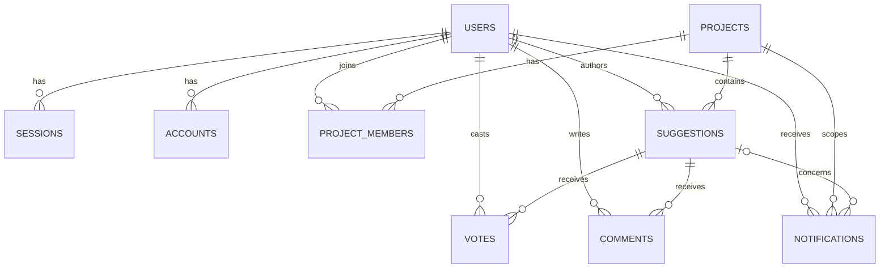
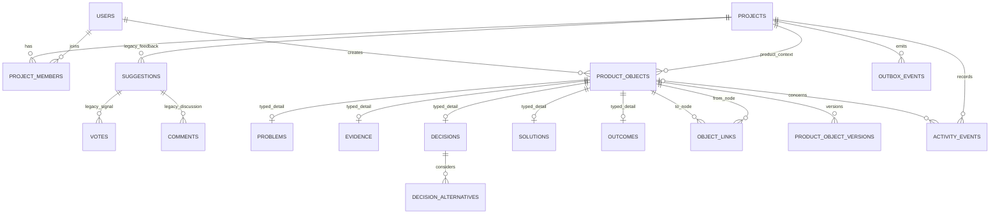

# Product Context repository audit and implementation plan

Status: implementation prerequisite  
Repository baseline: `feature/v2-product-os` at `7bd128a`  
Audit date: 2026-07-21

> **Current implementation note (2026-07-22):** Repository findings remain valid, but the rollout-grade implementation recommendations below assumed an existing user base and staged migration. Under the current assumption of effectively no users, [`lean-plan.md`](./lean-plan.md) supersedes recommendations for feature flags, per-Product activation, outbox/worker infrastructure, full-text search, richer roles/workspaces, broad agent parallelism, and full-stack test infrastructure.

## Executive assessment

InsightsWall is a small TypeScript modular monolith with a React/Vite frontend, a Hono API, PostgreSQL through Drizzle, Better Auth, and useful API and browser test foundations. The repository is suitable for the Product Context v2 direction without a rewrite.

The reusable foundation is narrower than the earlier product documents assume:

- there is no organization or workspace table;
- `projects` plus `project_members` are the current tenant and authorization boundary;
- `comments` and `notifications` exist only as database tables;
- there is no attachment storage, activity log, worker, queue, or outbox implementation;
- roadmap is not a separate domain: it is a view of suggestions whose status is `PLANNED`, `IN_PROGRESS`, or `DONE`;
- search is a case-insensitive substring filter over suggestion descriptions;
- current project and suggestion reads are deliberately public.

The recommended path is additive. Keep `projects` as the physical Product boundary for Phase 1, expose it as “Product” only through v2 interfaces, add new canonical graph tables, and leave all suggestion/roadmap routes and screens intact. Do not rename or reshape `suggestions` into `problems`.

Under the current lean assumption, the Phase 1 graph needs no runtime feature flags or per-Project activation state. Development-branch isolation, private routes, and delayed navigation are sufficient. Every Product Context read requires Project membership and every write requires the existing `ADMIN` role. Canonical mutations should run through application commands that write state and required activity/version records in one transaction.

Baseline verification at the audited revision:

- `npm run typecheck`: passes in all three workspaces;
- API integration tests: 65/65 pass across 3 files.

## 1. Current architecture and package structure

```text
insightswall/
├── apps/
│   ├── api/
│   │   ├── drizzle/                  # two generated SQL migrations + snapshots
│   │   ├── src/
│   │   │   ├── index.ts              # environment validation and process entrypoint
│   │   │   ├── server.ts             # composition root and Hono route registration
│   │   │   ├── lib/
│   │   │   │   ├── auth.ts           # Better Auth configuration
│   │   │   │   ├── db/               # Drizzle client and current schemas
│   │   │   │   └── middlewares/      # session, optional session, project-admin checks
│   │   │   └── modules/
│   │   │       ├── projects/          # domain/application/infrastructure/presentation
│   │   │       └── suggestions/       # domain/application/infrastructure/presentation
│   │   └── test/integration/          # PGlite-backed HTTP integration tests
│   └── web/
│       ├── src/
│       │   ├── api/                   # typed fetch wrappers (types are handwritten)
│       │   ├── hooks/                 # TanStack Query hooks
│       │   ├── routes/                # TanStack Router file routes
│       │   └── components/            # shared and shadcn-style UI
│       └── test/e2e/                  # Playwright UI tests with mocked HTTP
├── packages/types/                    # shared enum-like constants and union types
└── .github/workflows/ci.yml           # format, lint, build, API tests, Playwright
```

The API already follows the desired dependency direction:

```text
route -> use case -> repository interface -> Drizzle repository
```

This is reusable. `apps/api/src/server.ts` is a manual composition root, so v2 can be registered without adding a dependency-injection framework. The current `ServerConfig.db` and repository database fields are loosely or singleton-typed, however; v2 repositories should depend on a shared database interface/type that works for both node-postgres and PGlite rather than adding more `any`.

The frontend has a similarly usable flow:

```text
file route -> query/mutation hook -> API wrapper -> cookie-authenticated fetch
```

TanStack Router, TanStack Query, the API client, auth client, layouts, feedback components, and most UI primitives can be retained.

## 2. Existing domain entities and database schema

### Current domain entities

| Entity                            | Implemented behavior                                                                | Important limits                                                             |
| --------------------------------- | ----------------------------------------------------------------------------------- | ---------------------------------------------------------------------------- |
| Project                           | Create, list memberships, public get, admin update, hard delete                     | No workspace, owner field, visibility, slug, archive, or v2 activation state |
| Project member                    | Creator is inserted as `ADMIN`; current-user lookup                                 | Only `USER` and `ADMIN`; no invitation/member management route               |
| Suggestion                        | Create, edit by author, delete by author/admin, status update by admin, list/filter | Feedback ontology and 500-character description; not a Problem               |
| Vote                              | Vote/unvote and aggregate count                                                     | Signal is tightly tied to Suggestion                                         |
| Comment                           | Schema only                                                                         | No entity, repository, use case, API, or UI                                  |
| Notification                      | Schema and shared type constants only                                               | No entity, delivery, API, or UI                                              |
| User/session/account/verification | Managed by Better Auth                                                              | User primary keys are `text`, not UUID                                       |

### Current schema diagram



Current product tables use UUIDs. Better Auth tables use text IDs. Application timestamps are `timestamp without time zone`; auth timestamps default/update differently. Only Better Auth lookup indexes and primary/unique constraints exist. There are no explicit indexes on common application access paths such as `suggestions.project_id`, `project_members.user_id`, notification feeds, or suggestion timestamps.

The current migrations are:

1. `0000_numerous_millenium_guard.sql`: auth and product tables, enums, and foreign keys.
2. `0001_tidy_queen_noir.sql`: nullable suggestion rejection reason.

Drizzle migration snapshots and journal are committed. Integration tests apply these migrations to an in-memory PGlite database, which is a strong reusable migration test mechanism.

## 3. Authentication and authorization

Authentication uses Better Auth with:

- cookie-backed sessions;
- email/password sign-up with required email verification;
- Google OAuth;
- user deletion;
- Drizzle persistence;
- Resend for verification emails.

The API provides required-session and optional-session middleware. The frontend injects the current Better Auth session into router context and protects the `/_internal` route group.

Current server-side authorization is route-specific:

| Operation                  | Current access                            |
| -------------------------- | ----------------------------------------- |
| List own projects          | Authenticated member                      |
| Get project by ID          | Public                                    |
| Update/delete project      | Project `ADMIN`                           |
| Get own project membership | Authenticated member                      |
| List/search suggestions    | Public                                    |
| Create suggestion          | Any authenticated user, even a non-member |
| Edit suggestion            | Suggestion author                         |
| Delete suggestion          | Suggestion author or project `ADMIN`      |
| Change suggestion status   | Project `ADMIN`                           |
| Vote/unvote                | Any authenticated user                    |

These policies match a public feedback product, not private product context. The new domain must not inherit optional authentication or author-based feedback permissions.

Two route-integrity issues should not be copied into v2:

- edit and delete routes accept `projectId`, but their use cases look up and mutate only by `suggestionId`;
- permissions are split between middleware and use cases, so application services are not consistently safe when invoked outside HTTP.

For v2, authentication middleware should establish identity only. A reusable `ProductAccessPolicy` (backed by `project_members`) should enforce membership and role inside every command/query boundary. Route IDs and loaded objects must be checked against the same Product. The database should independently prevent cross-product links.

## 4. Workspace and Product boundaries

There is no organization, workspace, billing account, or workspace membership model in this repository. Statements in the earlier design documents about reusing organizations/workspaces do not match the code.

The only durable boundary is:

```text
Project -> Project members, Suggestions, Notifications
```

Current lean Phase 1 recommendation:

- treat an existing `projects.id` as `productId` in the v2 domain;
- keep the physical table and legacy `/api/projects` and `/project/:projectId` names;
- reuse existing Project creation/listing instead of adding a second Product creation flow;
- expose private context under `/api/product-context/projects/:projectId/...` and `/products/:projectId/...`;
- make all Product Context records private to project members regardless of the current public project/suggestion pages;
- defer a true workspace layer until membership, multi-product workspaces, or billing requires it.

The first slice does not need a Product adapter or activation marker. Existing transactional Project creation already creates the boundary and creator-as-admin membership. Product vocabulary can be introduced after the workflow is validated without duplicating persistence.

Hard deletion is a new safety concern. The current project repository deletes a project and its children. Canonical product memory should archive by default. New graph foreign keys should not silently cascade, and the legacy delete command should reject deletion with a clear conflict if canonical objects exist. Empty or legacy-only projects may retain current deletion behavior until cutover policy is decided.

## 5. Comments, notifications, activity, and attachments

| Capability          | Repository reality                                          | Phase 1 decision                                                                                 |
| ------------------- | ----------------------------------------------------------- | ------------------------------------------------------------------------------------------------ |
| Suggestion comments | Table only                                                  | Do not generalize it yet; preserve it for Phase 2 suggestion import                              |
| Notifications       | Table and enum only; route/repository code is commented out | Do not claim reuse beyond schema conventions; defer delivery UI/worker                           |
| Activity            | Absent                                                      | Add append-only `activity_events` and write transactionally from commands                        |
| Object history      | Absent                                                      | Add `product_object_versions`; version meaningful canonical edits and all decision state changes |
| Attachments         | Absent                                                      | Keep out of Phase 1; manual Evidence supports text plus source URL/label                         |

The existing `comments.suggestion_id` cannot become a general object comment without a breaking migration. Phase 2 should either add a new `product_object_comments` table or create a generalized comments table and import legacy rows. It should not repurpose the existing foreign key in place.

## 6. Background jobs and outbox capability

There is no worker process, scheduler, cron integration, queue dependency, job table, outbox, retry mechanism, or worker deployment configuration. The only asynchronous side effect is verification email sending, which is intentionally fire-and-forget from the Better Auth callback.

Do not add an outbox or worker in the first manual slice: it has no asynchronous side effect. When a concrete import or notification workflow needs durable processing, revisit a transactional outbox and a small Node worker. No separate queue product is justified before then.

## 7. Search implementation

Current search is limited to:

```sql
suggestions.description ILIKE '%query%'
```

It is project-scoped and combined with suggestion category/status filters. The web keeps filters in the URL, debounces text by 300 ms, and has tested loading and empty states. Those interaction patterns are reusable; the persistence query is not.

Phase 1 search should use a simple case-insensitive match over `product_objects.title` and `summary`. `SearchProductContext` remains scoped by `project_id`, excludes archived records, and returns direct object URLs. Full-text indexing, ranking, embeddings, and a vector database are deferred until real data demonstrates a problem.

## 8. Current feedback and roadmap coupling

Suggestions are the aggregate root for description, category, status, votes, and repository comments. The roadmap has no table, entity, repository, use case, or API. Its UI calls the suggestion list endpoint with these statuses:

```text
PLANNED, IN_PROGRESS, DONE
```

Dragging a roadmap card calls the suggestion status endpoint. Therefore:

- a roadmap item is exactly a suggestion in one of three statuses;
- promoting feedback to roadmap changes source feedback state;
- roadmap ordering is vote count/newest, not a separate persisted priority;
- there is no Release concept.

This coupling must remain isolated in the legacy module. In Phase 2, import every Suggestion as Evidence with status/votes/comments preserved as source metadata and signals. Separately propose roadmap suggestions as Solution candidates; do not turn their status into Problem or Solution canonical state automatically.

## 9. Migration tooling

Drizzle Kit generates and applies migrations from `apps/api/drizzle.config.ts`. The schema input currently comprises two files, and production uses `npm run db:migrate --workspace=@app/api`. PGlite integration tests run the committed SQL migrations from an empty database.

What is reusable:

- committed SQL migrations and snapshots;
- Drizzle's applied-migration journal;
- snake_case mapping;
- empty-database migration tests through PGlite.

What is missing:

- upgrade tests seeded at the latest legacy schema;
- down/rollback automation;
- production backup/restore validation;
- data migration checkpoints, dry runs, or reconciliation reports;
- idempotency keys for Phase 2 imports.

“Idempotent migrations” should mean two distinct things here:

1. DDL migrations are applied exactly once by the Drizzle journal and are tested from both empty and legacy baselines.
2. Phase 2 data imports are safely rerunnable through a unique migration key/source identity plus upsert-or-skip behavior.

Do not wrap every generated `CREATE TABLE` in `IF NOT EXISTS`, because that can conceal schema drift. Handwritten functions/triggers should use replace/drop-and-create patterns where appropriate.

## 10. Reuse and replacement matrix

| Existing module/file               | Decision                      | Exact use in v2                                                                                  |
| ---------------------------------- | ----------------------------- | ------------------------------------------------------------------------------------------------ |
| `apps/api/src/lib/auth.ts`         | Reuse                         | Session identity and Better Auth tables                                                          |
| `auth.middleware.ts`               | Reuse                         | Require identity on every v2 route                                                               |
| `optional-auth.middleware.ts`      | Legacy only                   | Never apply to canonical context routes                                                          |
| `project-admin.middleware.ts`      | Replace for v2                | Keep legacy behavior; enforce v2 permissions in `ProductAccessPolicy` inside commands/queries    |
| Projects domain/repository         | Adapt                         | Reuse `projects` identity and transactional creator membership; add Product-facing adapter/query |
| `project_members` table/repository | Adapt                         | Tenant membership source; extend query capabilities and settle role mapping                      |
| Suggestions module                 | Preserve unchanged            | Phase 2 source/import input only; never a canonical graph repository                             |
| Comments/notifications tables      | Preserve                      | Legacy data; no Phase 1 service reuse exists                                                     |
| `Server` composition root          | Reuse and split registrations | Instantiate v2 repositories/services and delegate route registration to a v2 router function     |
| Hono OpenAPI route/schema pattern  | Reuse                         | Request validation, response contracts, auth middleware, documented routes                       |
| Drizzle client/config/migrations   | Reuse and modularize          | Add product-context schema files and additive migrations                                         |
| `packages/types`                   | Reuse                         | Shared kinds, statuses, relationship types, and API-safe unions                                  |
| API PGlite test helpers            | Reuse and type                | Migration, transaction, invariant, permission, and HTTP integration tests                        |
| Web API client                     | Reuse                         | Cookie-authenticated JSON transport                                                              |
| TanStack Query hooks               | Reuse pattern                 | Product-scoped keys, invalidation, mutations, optimistic link updates only where safe            |
| TanStack Router layouts            | Reuse pattern                 | Add a private Product Context route tree; retain legacy public project route tree                |
| Suggestion filter UX/debounce      | Reuse interaction             | Search query-string state and debounced requests                                                 |
| Roadmap components/hooks           | Legacy only                   | Do not generalize into Solutions; build Solution UI against the new domain                       |
| Playwright harness                 | Reuse with an addition        | Keep fast mocked UI tests; add at least one real API+DB vertical-slice suite                     |

## 11. Proposed Phase 1 database design

> **Historical rollout-grade plan:** Sections 11–17 preserve the audit's original comprehensive recommendation and required-output trail. They are not the active backlog. Use [`lean-plan.md`](./lean-plan.md) and the active Phase 1–3 packets for implementation scope.

Use repository naming in storage: new tables reference `projects.id` through `project_id`, while the v2 code and API call that value `productId`. Keep Better Auth actor/owner foreign keys as `text`.

### Updated database diagram

Legacy tables remain present; the highlighted conceptual area below is additive.



### Table responsibilities and constraints

| Table/change              | Phase 1 responsibility                                                                                                                                                                   |
| ------------------------- | ---------------------------------------------------------------------------------------------------------------------------------------------------------------------------------------- |
| `projects` additions      | `product_context_enabled`, `archived_at`; v2 creation remains private and member-only                                                                                                    |
| `product_objects`         | Shared UUID identity, `project_id`, kind, title, summary, type-specific status, owner/creator text IDs, origin, search text/document, timestamps, archive, optional Problem merge target |
| `problems`                | Stage, impact summary, severity/confidence, affected segments, first/last observed timestamps                                                                                            |
| `evidence`                | Evidence type, original content, source label/author/URL, observation time, metadata; enough provenance for manual Evidence without Phase 2 source tables                                |
| `decisions`               | Question, outcome, rationale, consequences, decided/review timestamps; supersession is represented by a `SUPERSEDES` link and status/version history                                     |
| `decision_alternatives`   | Title, description, disposition, rejection reason, stable sort order                                                                                                                     |
| `solutions`               | Stage, hypothesis, expected outcome, execution URL, start/ship timestamps                                                                                                                |
| `outcomes`                | Type, result, optional numeric value/unit, required observation time, source label/URL, confidence                                                                                       |
| `object_links`            | Project-scoped typed directed edge, origin, creator, timestamps, archive, unique active semantic edge                                                                                    |
| `product_object_versions` | Immutable JSONB snapshot with monotonic per-object version, actor, reason, timestamp                                                                                                     |
| `activity_events`         | Append-only actor/event/object metadata feed scoped to one project                                                                                                                       |
| `outbox_events`           | Transactional event delivery state, retry count, availability/claim/process timestamps                                                                                                   |

Database invariants:

- `product_objects` has unique keys on `(project_id, id)` and `(id, kind)`.
- Each detail table stores a constant checked kind and uses a composite foreign key to `(product_objects.id, product_objects.kind)`, preventing a Decision detail row for a Problem object.
- `object_links` stores `project_id`; composite foreign keys `(project_id, from_object_id)` and `(project_id, to_object_id)` enforce same-product edges.
- A check prevents self-links except any explicitly approved relationship type.
- A partial unique index prevents duplicate active `(from, to, relationship_type)` links while allowing archived history.
- Problem merge targets and `SUPERSEDES` links must be same-product and same-kind; enforce with composite keys where possible and a small database trigger where a declarative constraint is insufficient.
- Foreign keys from canonical history to Product should restrict destructive deletion. Archives are application defaults.
- All new timestamps use `timestamptz`; user references use `text`.
- Common lists and reverse traversals receive project/kind/status/archive, link-from, link-to, activity-time, version, and outbox-claim indexes.
- Statuses and relationship values are text with application constants/checks rather than a single PostgreSQL enum that is hard to evolve.

Initial relationship catalogue for the vertical slice:

```text
Evidence --SUPPORTS--> Problem
Evidence --SUPPORTS--> Decision
Problem  --LED_TO----> Decision
Decision --SELECTS---> Solution
Solution --ADDRESSES-> Problem
Solution --MEASURED_BY-> Outcome
Decision --SUPERSEDES-> Decision
```

`CreateObjectLink` must validate allowed source kind, target kind, relationship type, and actor permissions before persistence. The database constraints remain the final same-product defense.

## 12. Proposed file and module changes

Keep legacy schema and modules in place. Add these files incrementally:

```text
apps/api/src/
├── config/
│   └── feature-flags.ts
├── lib/db/
│   ├── schema.ts                         # legacy schema retained
│   └── schema/product-context/
│       ├── product-objects.ts
│       ├── object-links.ts
│       ├── evidence.ts
│       ├── problems.ts
│       ├── decisions.ts
│       ├── solutions.ts
│       ├── outcomes.ts
│       ├── activity-events.ts
│       └── outbox-events.ts
└── modules/product-context/
    ├── domain/
    │   ├── product-object.ts
    │   ├── object-link.ts
    │   ├── lifecycles.ts
    │   ├── errors.ts
    │   └── repositories.ts
    ├── application/
    │   ├── product-access-policy.ts
    │   ├── transaction-manager.ts
    │   ├── commands/
    │   │   ├── create-product.ts
    │   │   ├── create-problem.ts
    │   │   ├── create-evidence.ts
    │   │   ├── link-evidence-to-problem.ts
    │   │   ├── create-object-link.ts
    │   │   ├── create-decision.ts
    │   │   ├── supersede-decision.ts
    │   │   ├── create-solution.ts
    │   │   └── record-outcome.ts
    │   └── queries/
    │       ├── list-problems.ts
    │       ├── get-problem-context.ts
    │       ├── list-decisions.ts
    │       └── search-product-context.ts
    ├── infrastructure/
    │   ├── product-context.repository.ts
    │   ├── product-access.repository.ts
    │   └── transaction-manager.drizzle.ts
    └── presentation/
        ├── register-product-context-routes.ts
        ├── schemas.ts
        └── routes/

apps/api/test/
├── unit/product-context/
├── integration/product-context-schema.test.ts
├── integration/product-context-permissions.test.ts
└── fixtures/product-context.fixture.ts

apps/web/src/
├── config/feature-flags.ts
├── api/product-context/
├── hooks/product-context/
├── components/product-context/
└── routes/products/
    └── $productId/
        ├── route.tsx                     # private v2 shell/navigation
        ├── today/
        ├── problems/
        ├── decisions/
        ├── solutions/
        ├── evidence/
        ├── review/
        └── search/

apps/web/test/e2e/
├── product-context.spec.ts
└── helpers/product-context-api.ts

packages/types/src/
└── product-context.ts

docs/product-context/
├── repository-audit.md
└── adr/
    ├── 0001-reuse-insightswall-repository.md
    ├── 0002-add-v2-canonical-domain-tables.md
    ├── 0003-use-postgresql-as-relational-graph.md
    ├── 0004-keep-a-modular-monolith.md
    ├── 0005-separate-candidates-from-canonical-knowledge.md
    └── 0006-use-additive-side-by-side-migration.md
```

The web route filename details should follow the exact TanStack Router version's file-route conventions when implemented; the URL contract is the stable part. The generated `routeTree.gen.ts` must continue to be generated, not hand-edited.

## 13. Migration sequence

### Phase 1 schema migrations

1. **Product bridge**
   - add `projects.product_context_enabled` with `false` default;
   - add nullable `projects.archived_at`;
   - add missing indexes on project membership access paths;
   - do not activate existing projects automatically.

2. **Canonical nodes and first details**
   - create `product_objects`, `problems`, and `evidence`;
   - add composite uniqueness and kind/detail constraints;
   - add archive and full-text search columns/indexes.

3. **Graph and remaining details**
   - create `object_links`, `decisions`, `decision_alternatives`, `solutions`, and `outcomes`;
   - add same-product composite foreign keys, allowed-link checks, and traversal indexes.

4. **History and reliable side effects**
   - create `product_object_versions`, `activity_events`, and `outbox_events`;
   - add version uniqueness and activity/outbox feed indexes.

5. **Legacy delete guard**
   - update the project delete application service to detect canonical objects and return a domain conflict rather than relying on a database error;
   - retain hard delete for products with no canonical context until the cutover policy changes.

Each migration should be tested from an empty database and from a fixture representing migration `0001`. No suggestion data is copied during Phase 1.

### Phase 2 data migration sequence

1. Add `source_connections`, `source_artifacts`, candidate tables, and unique `(source_type, external_id, migration_version)` identity.
2. Dry-run and reconcile counts per project.
3. Import each Suggestion as a Source Artifact and Evidence, preserving original ID, author, timestamps, category, status, and content.
4. Preserve vote counts/account signals and comments without treating them as canonical Problems.
5. Propose roadmap-status suggestions as Solution candidates.
6. Generate Problem candidates only into the review queue.
7. Rerun imports to prove idempotency, compare counts, then enable v2 per project.

## 14. Risk list

| Risk                                                                     |         Severity | Mitigation                                                                                                     |
| ------------------------------------------------------------------------ | ---------------: | -------------------------------------------------------------------------------------------------------------- |
| Design docs assume workspaces that do not exist                          |             High | Use Project as the Phase 1 Product/auth boundary; do not introduce a speculative workspace migration           |
| Current Product metadata is publicly readable                            |             High | Keep canonical v2 routes member-only; decide separately whether v2 activation changes legacy public metadata   |
| Existing hard project delete could erase canonical history               |         Critical | Restrictive graph FKs plus an application-level conflict/archive path                                          |
| Existing `USER`/`ADMIN` roles do not express viewer/editor/owner         |             High | Lock a role mapping before mutation routes; keep permission logic centralized                                  |
| User IDs in conceptual SQL are UUIDs but actual Better Auth IDs are text |             High | Use text foreign keys for all actor/owner fields and reflect that in ADR/schema                                |
| App timestamps and auth timestamps are inconsistent                      |           Medium | Use `timestamptz` for new tables and normalize API serialization; avoid rewriting legacy timestamps in Phase 1 |
| Detail kind or cross-product graph edges can drift                       |         Critical | Composite FKs/checks, targeted trigger tests, and application validation                                       |
| Activity/version records could be written non-atomically                 |         Critical | One transaction manager used by every canonical command                                                        |
| Outbox is added without a deployed consumer                              |   Low in Phase 1 | Store only required durable events; add worker with first async use case and monitor backlog then              |
| Search text can become stale after detail edits                          |             High | Build search text in the same command/transaction and test every mutation path                                 |
| PGlite behavior may differ from production PostgreSQL for FTS/triggers   |           Medium | Keep PGlite fast tests and add a CI PostgreSQL service test for schema invariants before rollout               |
| Current browser tests mock the API and cannot prove auth/DB behavior     |             High | Add one real full-stack vertical-slice E2E while retaining mocked UI tests                                     |
| `server.ts` manual wiring becomes unwieldy                               |           Medium | Register v2 through one module-level composition function; do not add a DI framework                           |
| Legacy comment/notification schemas may tempt premature reuse            |           Medium | Treat them as Phase 2 migration inputs; introduce object-scoped services deliberately                          |
| Current route parameters are not always checked against loaded records   |             High | Make every v2 repository query project-scoped and verify object/product identity in commands                   |
| PostgreSQL enums are difficult to remove or reorder                      |           Medium | Use text plus shared constants/checks for evolving v2 lifecycles                                               |
| Relationship catalogue grows into an ungoverned graph                    |           Medium | Ship only vertical-slice relationships and validate allowed kind pairs                                         |
| A global flag alone could expose half-migrated projects                  |             High | Combine global deploy flags with per-project `product_context_enabled` activation                              |
| Product Context becomes documentation overhead                           | Product-critical | Keep the first flow short, use the shared realistic fixture, and validate real PM use before integrations/AI   |

## 15. Milestone breakdown

### Milestone 0 — decisions and ADRs

- settle the schema-blocking questions below;
- add the six repository-specific ADRs;
- define API/web feature flags and `/api/v2/products` route strategy;
- freeze the first relationship/status catalogue.

Exit: reviewers agree on the physical Project/Product bridge and authorization policy.

### Milestone 1 — graph foundation

- add the Phase 1 migrations in the sequence above;
- implement typed repositories, transaction manager, access policy, lifecycle guards, object links, archive, versions, activity, and outbox writes;
- cover cross-product links, detail-kind consistency, merge/supersession, archive, and permissions with unit/integration tests.

Exit: invariants are enforced without an HTTP or UI dependency.

### Milestone 2 — Problem and Evidence slice

- implement Product activation/creation, Problem creation/list/detail, manual Evidence, and Evidence-to-Problem links;
- expose member-only OpenAPI routes;
- add the flagged v2 shell with Problems and Evidence screens.

Exit: a member can create a private Product, Problem, Evidence, and link them; activity appears on Problem detail.

### Milestone 3 — Decision, Solution, and Outcome chain

- implement Decisions with alternatives, rationale, versions, and supersession;
- implement Solutions and Outcomes plus allowed links;
- extend Problem context query and page to navigate the complete chain.

Exit: the realistic fixture completes Evidence → Problem → Decision → Solution → Outcome.

### Milestone 4 — search and beta-quality vertical slice

- add full-text search, kind/status filters, and direct navigation;
- add Today and Review placeholders plus final v2 navigation;
- add the shared fixture to unit, integration, E2E, and demo data;
- run a real full-stack E2E covering the lifecycle and a non-member authorization case;
- verify legacy project/suggestion/roadmap tests remain green.

Exit: all Phase 1 definition-of-done items are demonstrated behind disabled-by-default flags.

### Milestone 5 — existing data migration (Phase 2, not Phase 1)

- introduce source artifacts and candidates;
- import suggestions as Evidence and preserve signals/comments;
- propose roadmap-derived Solutions and AI-derived Problems through review only.

## 16. Product decisions required

The following recommendations allow implementation to proceed, but the owner should explicitly lock the first five before the corresponding migrations/routes merge.

| Decision                              | Recommendation                                                                                                          | Blocks                               |
| ------------------------------------- | ----------------------------------------------------------------------------------------------------------------------- | ------------------------------------ |
| Physical Product identity             | Reuse `projects`; Product is v2 vocabulary and API, not a duplicate table                                               | First schema migration               |
| Workspace scope                       | Defer workspaces; Project is the Phase 1 membership boundary                                                            | First schema migration               |
| Role mapping                          | Initially `ADMIN` can manage/edit and legacy `USER` can edit; add a viewer role only with a clear membership migration  | Mutation routes and permission tests |
| Lifecycle values                      | Use the Problem/Decision/Solution states in `02-DOMAIN-AND-ARCHITECTURE.md`; keep values as text constants              | Detail schema and command tests      |
| Relationship direction/catalogue      | Adopt the seven vertical-slice relationships listed in this audit; expand only through ADR updates                      | Link schema and commands             |
| Evidence edit policy                  | Preserve `original_content`; edits change annotations/normalized fields and create versions, never rewrite the original | Evidence update behavior             |
| Decision supersession source of truth | Use `SUPERSEDES` link + statuses + versions; do not also maintain an independent pointer                                | Decision command/query               |
| Product deletion                      | Archive canonical Products; allow hard delete only when no canonical objects exist                                      | Legacy delete guard                  |
| V2 route/flag strategy                | `/api/v2/products` and `/products`; global flags plus per-project activation                                            | API/UI shell                         |
| Default v2 home                       | Problems for empty/Phase 1 products; Today can become default when it has useful content                                | Navigation behavior                  |
| “Solution” UI term                    | Keep “Solution” through Phase 1 usability tests; storage/API remain stable if the label changes                         | UI copy only                         |
| Public legacy surfaces                | Keep them unchanged during Phase 1, but never expose canonical context through them                                     | Cutover and positioning              |

No AI auto-accept policy, source retention policy, external integration, or MCP decision blocks Phase 1 because those capabilities are explicitly deferred.

## 17. First implementation PR plan

Proposed PR title:

```text
feat(product-context): add guarded graph foundation
```

Keep the first PR deliberately non-user-facing:

1. Add ADRs 0001–0006 and feature-flag configuration with both flags off by default.
2. Add shared Product Context kind/status/origin/relationship constants.
3. Add the Product bridge columns without activating existing projects.
4. Add only the first graph foundation tables: `product_objects`, `problems`, `evidence`, `object_links`, `product_object_versions`, and `activity_events`.
5. Add composite foreign keys/checks/indexes for same-product links and kind/detail consistency.
6. Add PGlite integration tests for migration, cross-product link rejection, wrong-detail-kind rejection, active-link uniqueness, archive visibility assumptions, and restrictive Product deletion.
7. Add PostgreSQL-backed CI coverage if PGlite cannot faithfully exercise a constraint or FTS behavior.

Explicitly exclude from the first PR:

- routes, navigation, or screens;
- Decision/Solution/Outcome tables and commands;
- legacy suggestion import;
- comments, notifications, attachments, or a worker;
- AI, integrations, embeddings, MCP, and public-roadmap changes.

This PR is independently safe because its schema is additive, flags remain off, no existing project is activated, and no current route writes to the new tables. The next PR can add the transaction/access-policy layer and the first Problem/Evidence commands against a reviewed foundation.

## 18. Audit completion checklist

- [x] Current architecture and package structure
- [x] Existing entities and current schema diagram
- [x] Authentication and authorization
- [x] Workspace/Project/Product boundaries
- [x] Comments, notifications, activity, and attachments
- [x] Background jobs and outbox capability
- [x] Search implementation
- [x] Feedback and roadmap coupling
- [x] Migration tooling
- [x] Exact reuse/replacement matrix
- [x] Proposed file/module changes
- [x] Updated database diagram
- [x] Migration sequence
- [x] Risk list
- [x] Milestone breakdown
- [x] Questions requiring product decisions
- [x] Reviewable first implementation PR plan
